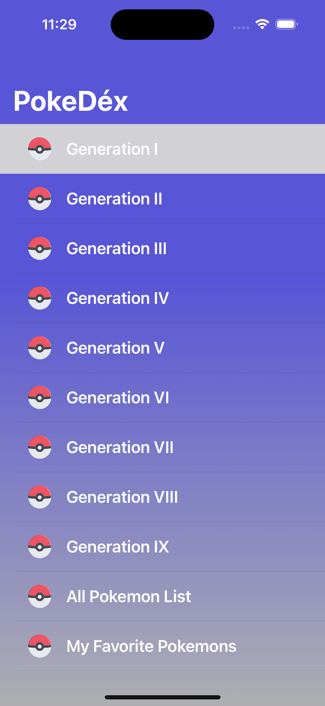
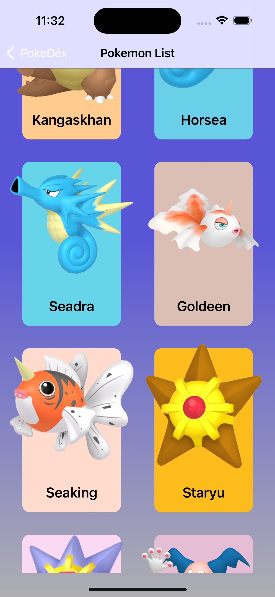
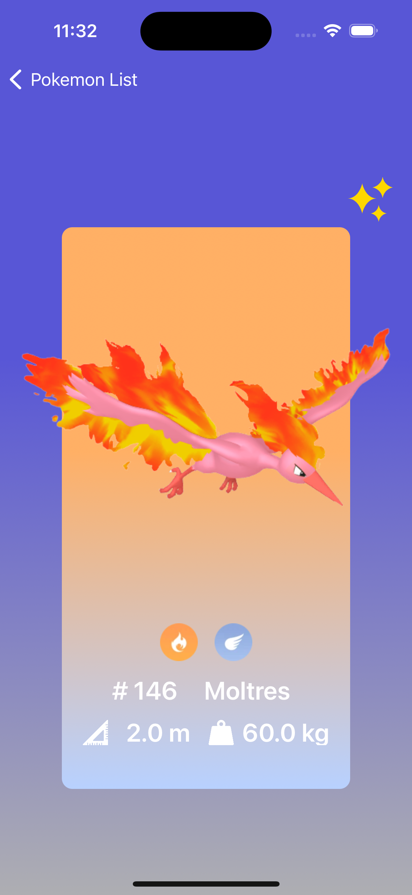
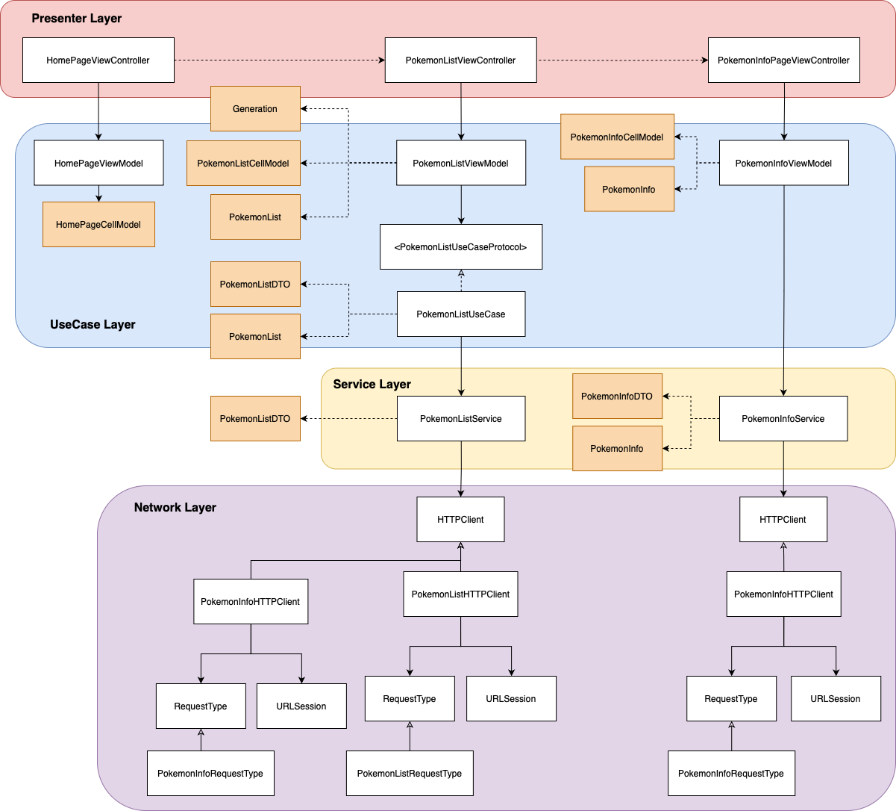

# PokeDexDemo App

## App preview
<table>
  <tr>
 <td style="text-align: center;">
     
    <p><strong>圖 1：可選不同世代的寶可夢列表</strong></p>
  </td>
<td>
<td style="text-align: center;">
    
    <p><strong>圖 2：寶可夢列表展示</strong></p>
  </td>
<td>
<td style="text-align: center;">
    
    <p><strong>圖 3：可切換顯示shiny版本寶可夢</strong></p>
  </td>
<tr></table>

## High Level UML Diagram

<br>
[PokeDexDem High Level UML Diagram](https://drive.google.com/file/d/1S2-nKjdItamuEu0_dznEUa2Jms0Yaf8a/view?usp=sharing)<br>

## Table of Contents
- [Introduction](#introduction)<br>
- [Setup](#setup)<br>
- [Usage](#usage)<br>
- [Architecture](#architecture)<br>
- [Features](#features)<br>
- [Technologies](#technologies)<br>
- [Contributing](#contributing)<br>
- [License](#license)<br>

## Introduction
**PokedexDemo** 是基於 **Swift** 語言開發的iOS應用程式。這個專案使用公開的 [PokéAPI](https://pokeapi.co/) 資料庫中所提供的各種詳細的寶可夢設定數據，並將這些數據與圖片以圖鑑方式呈現。主要目的是展示如何通過自定義的 RESTful API 發送網路請求、解析JSON資料結構，並將數據轉化為可互動的 UI 元件，用以展示寶可夢的各項屬性和 Shiny 版本圖片。
<br>

## Setup
- **環境需求**

  Xcode 14.0 或以上版本<br>
  iOS 16.4 或以上版本<br>
- **安裝步驟**
  下載或複製這個 repository：<br> 

```bash

複製程式碼
git clone https://github.com/ChaoMing0815/PokedexDemo.git
cd PokedexDemo

```
使用 Swift Package Manager 安裝依賴項： 在 Xcode 中，選擇 File > Swift Packages > Resolve Package Versions。<br> 
配置 API 密鑰： 本專案使用公開 API，因此不需要特殊的 API 密鑰配置。直接運行即可。<br> 

## Usage
在 Xcode 中打開專案檔案，選擇目標模擬器或連結手機。<br> 
以`⌘ + R`指令開始運行專案，應用程式將在模擬器或設備上啟動。<br> 
瀏覽寶可夢清單，點擊寶可夢可進入查看詳細資料，並使用 Shiny 按鈕切換 Shiny 版本圖片。<br> 

## Architecture

- PokedexDemo 採用 **MVVM（Model-View-ViewModel** 架構模式進行開發，實現了高度模組化和易維護的代碼結構。<br><br>
- **Model** 層包含 **DTO（Data Transfer Object）** 和 Domain Model 的分離設計。以 DTO 來專門處理從 API 接收的數據格式，與後端數據保持一致，確保了網路層的穩定性。提高了數據層的靈活性，也使數據能夠在 API 層和應用內部模型間無縫轉換。<br><br>
- 針對較為複雜的數據業務邏輯建立 **UseCase** 層，分離網路層與 ViewModel 層，讓數據處理和業務邏輯不依賴於具體的數據源。也可避免 ViewModel 層因多種業務邏輯而過於複雜。<br><br>

## Features
- **寶可夢列表瀏覽**：<br> 
  依據世代分類載入寶可夢列表，讓使用者按需求瀏覽，方便查找不同世代寶可夢。<br> 
  寶可夢列表頁面支持分頁加載，避免單次發送大量網路請求導致程式卡頓，優化使用者體驗。<br> 
  <br> 
- **寶可夢個別資訊展示**：<br> 
  從列表頁點擊有興趣的寶可夢，進入個別資訊頁面顯示該寶可夢的屬性、身高、體重等資訊。<br> 
  個別展示頁面會根據寶可夢屬性呈現背景顏色。<br> 
  <br> 
- **Shiny 切換**：<br> 
  在個別展示頁面可以使用 Shiny 按鍵自由切換顯示每隻寶可夢的 Shiny 或一般版本圖片。<br> 
  點擊按鈕切換時增加圖片轉換的動畫效果，增加用戶互動性並保持體驗的流暢度。<br> 

## Technologies
- **Swift**：使用 Swift 語言進行 iOS 應用開發。<br><br>
- **UIKit**：使用 UIKit 框架構建簡單直觀的用戶界面，並自定義各種 Factory Method 創建 UI 元件。<br><br>
- **SnapKit**：基於 SnapKit 的 UI 佈局的框架，可根據資料自動進行佈局調整，簡化視圖的約束設定。<br><br>
- **Clean Architecture**：使用 MVVM 架構確保 View 和 Model 間的解耦，避免 Fat ViewController。並透過分離 DTO 與 DomainModel 增強數據層的穩定性與靈活性。<br><br>
- **API數據整合**：從公開的 [PokéAPI](https://pokeapi.co/) 獲取最新寶可夢資料與圖片，並將其資料結構解析轉化為 Domain Model 於應用程式中使用。<br><br> 
- **Network Layer 架構設計**：自定義網路層架構，可針對不同的API請求類型進行調整、擴展，並對數據進行分層管理，符合 SOLID 原則，提高程式碼的可重用性與可測試性。<br><br> 
- **RESTFul API數據整合**：使用 URLSession 構建 RESTful 網路層，對 PokéAPI 提供的豐富寶可夢資料進行處理和轉換，實現穩定且可擴展的資料層架構。<br>

## Contributing
歡迎任何形式的貢獻！如果你想參與開發或給予建議，可以按照以下步驟：
<br>
Fork 此專案。
創建新的分支來開發新功能：

```bash

複製程式碼
git checkout -b feature/新功能名稱

```

提交更改並推送到自己的分支後發送 Pull Request。

## License
該專案在 MIT 許可下發布，有關詳細信息，請參閱 [LICENSE](./LICENSE.md) 文件。

